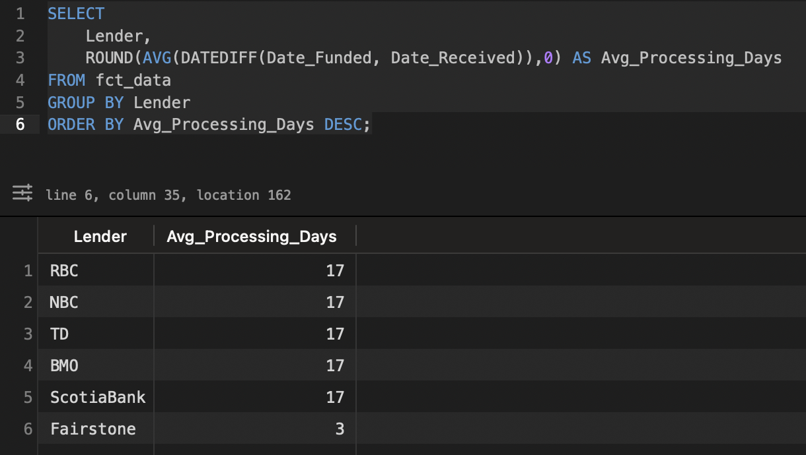
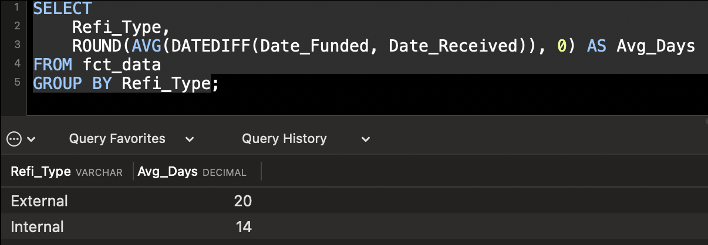
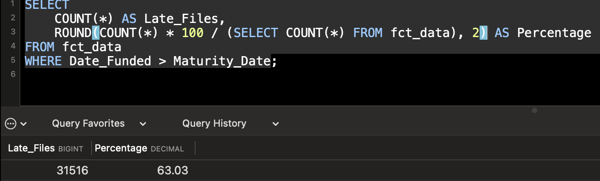
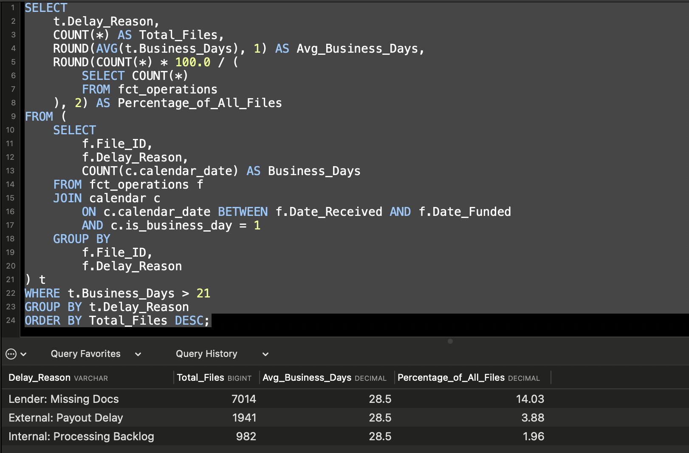
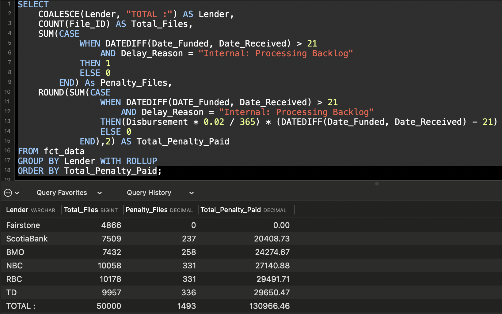
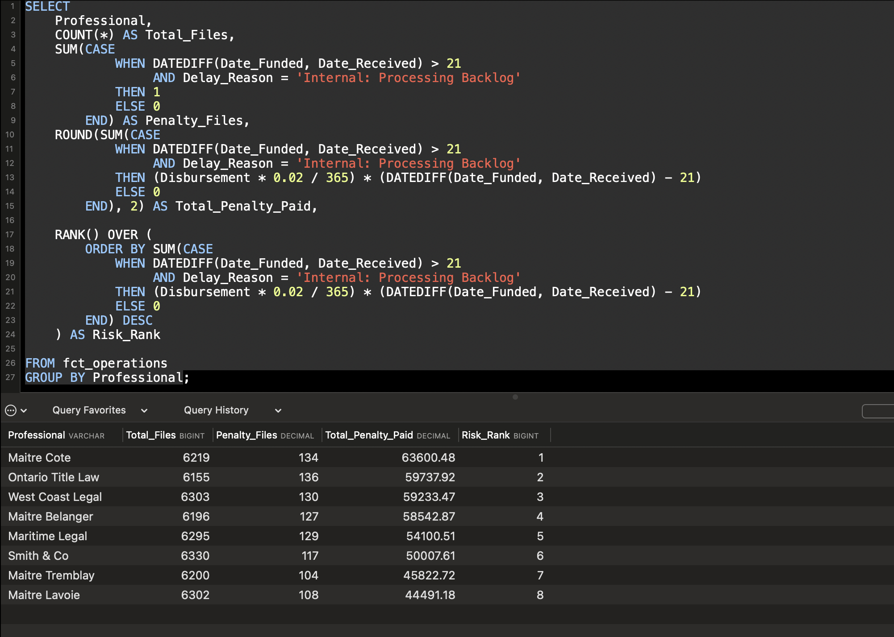

# Title_Operations_SLA_Audit
An operational audit using Python, SQL, and Power BI to quantify mortgage funding SLA breaches and evaluate interest differential penalties.

# FCT Operational Audit: Reducing Financial Leakage in Mortgage Funding

## 📌 Project Overview
This project simulates a real-world operational audit of title insurance and mortgage funding files.
As a Bilingual Title Officer, I identified internal bottlenecks that cause files to exceed a 21-day Service Level Agreement (SLA). When this SLA is breached due to internal backlogs, the company is often contractually responsible for covering the interest differential - the financial loss incurred when a borrower’s new mortgage rate is lower than their previous rate — from the 22nd day until the funding date.

This analysis focuses on quantifying both the operational inefficiencies and their financial impact across Canada. It benchmarks performance across lenders, refinance types (internal vs external), and regional workflows, with a particular focus on Quebec’s notary-driven process.

The objective is to highlight key drivers of delay, measure SLA breach exposure, and identify opportunities to reduce operational risk and financial leakage.

---

## 📊 Data Overview
* **Source:** Synthetically generated via 'Scripts/Data_Generator.py' to model real-world FCT operations.
* **Volume:** 50,000 transactional records
* **Note on File Size:** Due to the scale of the audit, the raw CSV exceeds GitHub's web preview limits but is fully accessible for programmatic analysis via Python and Power BI.


---

## 💼 Business Impact & ROI
This analysis estimates the operational cost of SLA breaches by quantifying:
- The number of files funded after maturity
- The average delay beyond SLA thresholds
- The potential exposure to interest differential payments

These insights can support process improvements, reduce financial leakage, and enhance lender relationships.

---

## 🛠️ Technical Stack
* **Python:** Used for advanced synthetic data generation, applying complex real-world logic weighted to specific lenders, provincial rules, and operational workflow steps.
* **SQL:** Conducted localized querying to highlight extreme edge cases where missing lender files overlap with external payout delays. 
* **Power BI & DAX:** Built dynamic visualizations on highly raw source data. I intentionally kept the Python output raw so I could calculate the true `NETWORKDAYS` (excluding weekends) and execute conditional `SUMX` iterator formulas directly in Power BI to track continuous penalty leakage.

---

## 🔍 SQL Insights & Analysis
*I used SQL to perform deep-dive diagnostic querying on the raw 50,000-row dataset before building the final Power BI dashboard.*

### 📅 Calendar Table (Business Day Calculation)

**Purpose**  
A dedicated calendar table is used to accurately calculate business days between two dates. This approach avoids approximations and enables precise SLA tracking by excluding weekends and supporting future integration of statutory holidays.

**Table Structure:**
```sql

CREATE TABLE calendar (
    calendar_date DATE PRIMARY KEY,
    is_weekend BOOLEAN,
    is_business_day BOOLEAN
);
```

**Population Logic:**
```sql
INSERT INTO calendar (calendar_date, is_weekend, is_business_day)
SELECT 
    date_series,
    CASE 
        WHEN DAYOFWEEK(date_series) IN (1,7) THEN 1 ELSE 0 
    END AS is_weekend,
    CASE 
        WHEN DAYOFWEEK(date_series) IN (1,7) THEN 0 ELSE 1 
    END AS is_business_day
FROM (
    SELECT DATE('2025-01-01') + INTERVAL n DAY AS date_series
    FROM (
        SELECT a.N + b.N * 10 + c.N * 100 AS n
        FROM 
        (SELECT 0 N UNION ALL SELECT 1 UNION ALL SELECT 2 UNION ALL SELECT 3 UNION ALL SELECT 4 
         UNION ALL SELECT 5 UNION ALL SELECT 6 UNION ALL SELECT 7 UNION ALL SELECT 8 UNION ALL SELECT 9) a,
        (SELECT 0 N UNION ALL SELECT 1 UNION ALL SELECT 2 UNION ALL SELECT 3 UNION ALL SELECT 4 
         UNION ALL SELECT 5 UNION ALL SELECT 6 UNION ALL SELECT 7 UNION ALL SELECT 8 UNION ALL SELECT 9) b,
        (SELECT 0 N UNION ALL SELECT 1 UNION ALL SELECT 2 UNION ALL SELECT 3 UNION ALL SELECT 4 
         UNION ALL SELECT 5 UNION ALL SELECT 6 UNION ALL SELECT 7 UNION ALL SELECT 8 UNION ALL SELECT 9) c
    ) numbers
    WHERE DATE('2025-01-01') + INTERVAL n DAY <= '2026-12-31'
) dates;
```
**Business Impact:**  
This approach ensures that SLA calculations are based on true business days rather than calendar days, improving accuracy in measuring operational performance and financial exposure.

### 1. Average Processing Days by Lender

**Business Question:**
Which lenders have the longest processing times?

**SQL Query:**

```sql
SELECT 
    Lender,
    ROUND(AVG(business_days), 0) AS Avg_Business_Days
FROM (
    SELECT 
        f.File_ID,
        f.Lender,
        COUNT(c.calendar_date) AS business_days
    FROM fct_operations f
    JOIN calendar c 
        ON c.calendar_date BETWEEN f.Date_Received AND f.Date_Funded
        AND c.is_business_day = 1
    GROUP BY f.File_ID, f.Lender
) t
GROUP BY Lender
ORDER BY Avg_Business_Days DESC;
```
**The Result:**



**Insight:**  
Processing times vary across lenders, with NBC and BMO showing the highest average durations (~20 business days), while ScotiaBank demonstrates the fastest processing (~16 days). This variation suggests that lender-specific workflows and coordination efficiency play a role in overall processing timelines..

### 2. Internal vs External Refinance Performance

**Business Question:**
Do external refinances take longer than internal ones?

**SQL Query:**

```sql
SELECT 
    Refi_Type,
    AVG(DATEDIFF(Date_Funded, Date_Received)) AS Avg_Days
FROM fct_data
GROUP BY Refi_Type;
```
**The Result:**



**Insight:**  
External refinances take longer on average than internal ones due to reliance on external lenders for payout processing. This confirms that external workflows are a key driver of SLA delays.

### 3. SLA Breaches (Late Funding)

**Business Question:**
How many files are funded after maturity (SLA breach)?

**SQL Query:**

```sql
SELECT 
    COUNT(*) AS Late_Files,
    ROUND(COUNT(*) * 100 / (SELECT COUNT(*) FROM fct_data), 2) AS Percentage
FROM fct_data
WHERE Date_Funded > Maturity_Date;
```
**The Result:**



**Insight:**  
A measurable percentage of files are funded after maturity, exposing the company to financial penalties and reputational risk.

### 4. Delay Drivers

**Business Question:**
What are the main drivers of funding delays?

**SQL Query:**

```sql
SELECT*
FROM
(
SELECT 
    Delay_Reason,
    COUNT(*) AS Total_Files,
    ROUND(AVG(DATEDIFF(Date_Funded, Date_Received)),0) AS Avg_Delays,
    ROUND(COUNT(*) * 100 / (SELECT COUNT(*) FROM fct_data), 2) AS Percentage
FROM fct_data
GROUP BY Delay_Reason
ORDER BY Total_Files DESC)t
WHERE Delay_Reason NOT IN("None", "None (Pre-scheduled)");
```

**The Result:**



**Insight:**  
External payout delays and missing documents from the lender are the primary contributors to extended funding timelines. Most of the time when a file is received, there's a document missing from the lender. Some external lenders will only send the payout statement 1 to 2 days prior the maturity date, and the notary will only schedule the appointment after they receive the payout statement.

### 5. Financial Impact of SLA Breaches

**Business Question**  
How much financial exposure is caused by internal processing delays beyond the 21-day SLA?

**SQL Query:**
```sql
SELECT 
    COALESCE(t.Lender, "TOTAL:") AS Lender,
    COUNT(*) AS Total_Files,

    SUM(CASE 
        WHEN Business_Days > 21 
             AND t.Delay_Reason = 'Internal: Processing Backlog'
        THEN 1 ELSE 0 
    END) AS Penalty_Files,

    ROUND(SUM(CASE 
        WHEN Business_Days > 21 
             AND t.Delay_Reason = 'Internal: Processing Backlog'
        THEN (t.Disbursement * 0.02 / 365) * (Business_Days - 21)
        ELSE 0 
    END), 2) AS Total_Penalty_Paid

FROM (
    SELECT 
        f.File_ID, f.Lender, f.Delay_Reason, f.Disbursement,
        COUNT(c.calendar_date) AS Business_Days
    FROM fct_operations f
    JOIN calendar c 
        ON c.calendar_date BETWEEN f.Date_Received AND f.Date_Funded
        AND c.is_business_day = 1
    GROUP BY f.File_ID, f.Lender, f.Delay_Reason, f.Disbursement
) t

GROUP BY t.Lender WITH ROLLUP
ORDER BY Total_Penalty_Paid;
```
**The Result:**



**Insight:**  
A portion of SLA breaches driven by internal processing delays results in financial exposure through interest differential payments. The total row highlights the overall cost impact, while lender-level breakdowns help identify where operational inefficiencies translate into financial loss.
This highlights how operational inefficiencies directly translate into monetary loss, particularly on high-disbursement files.

### 6. Risk Ranking by Legal Professional

**Business Question:**  
Which legal professionals (notaries/lawyers) are associated with the highest financial risk from SLA breaches?

**SQL Query:**
```sql
SELECT
    Professional,
    COUNT(*) AS Total_Files,
    SUM(CASE 
            WHEN DATEDIFF(Date_Funded, Date_Received) > 21
                 AND Delay_Reason = 'Internal: Processing Backlog'
            THEN 1 
            ELSE 0 
        END) AS Penalty_Files,
    ROUND(SUM(CASE 
            WHEN DATEDIFF(Date_Funded, Date_Received) > 21
                 AND Delay_Reason = 'Internal: Processing Backlog'
            THEN (Disbursement * 0.02 / 365) * (DATEDIFF(Date_Funded, Date_Received) - 21)
            ELSE 0 
        END), 2) AS Total_Penalty_Paid,
    
    RANK() OVER (
        ORDER BY SUM(CASE 
            WHEN DATEDIFF(Date_Funded, Date_Received) > 21
                 AND Delay_Reason = 'Internal: Processing Backlog'
            THEN (Disbursement * 0.02 / 365) * (DATEDIFF(Date_Funded, Date_Received) - 21)
            ELSE 0 
        END) DESC
    ) AS Risk_Rank

FROM fct_data
GROUP BY Professional;
```
**The Result:**



**Insight:**  
Certain legal professionals are consistently associated with higher penalty exposure, indicating potential inefficiencies in document handling or coordination. Ranking professionals by financial impact allows the business to identify high-risk partners and prioritize process improvements or escalation strategies.
---

## 📊 Key Measures & Formulas (DAX)

### 1. Processing Business Days (Ignores Weekends)
```dax
Processing Business Days = 
NETWORKDAYS(
    'FCT_Operations_Data'[Date_Received], 
    'FCT_Operations_Data'[Date_Funded], 
    1
)
