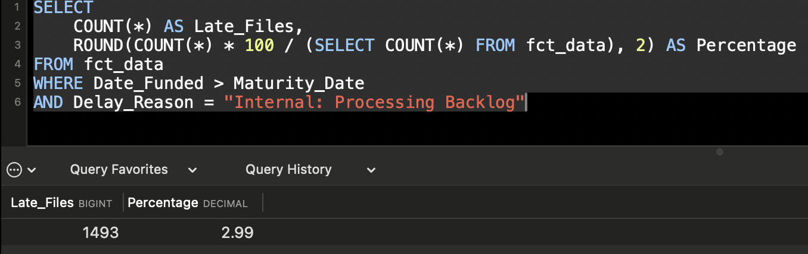

# Title_Operations_SLA_Audit
An operational audit using Python, SQL, and Power BI to quantify mortgage funding SLA breaches and evaluate interest differential penalties.

# FCT Operational Audit: Reducing Financial Leakage in Mortgage Funding

## 📌 Project Overview
This project simulates a real-world operational audit of title insurance and mortgage funding files.
As a Bilingual Title Officer, I identified internal bottlenecks that cause files to exceed a 21-day Service Level Agreement (SLA). When this SLA is breached due to internal backlogs, the company is often contractually responsible for covering the interest differential - the financial loss incurred when a borrower’s new mortgage rate is lower than their previous rate — from the 22nd day until the funding date.

This analysis focuses on quantifying both the operational inefficiencies and their financial impact across Canada. It benchmarks performance across lenders, refinance types (internal vs external), and regional workflows, with a particular focus on Quebec’s notary-driven process.

The objective is to highlight key drivers of delay, measure SLA breach exposure, and identify opportunities to reduce operational risk and financial leakage.

---

## 📊 Data Overview
* **Source:** Synthetically generated via 'Scripts/Data_Generator.py' to model real-world FCT operations.
* **Volume:** 50,000 transactional records
* **Note on File Size:** Due to the scale of the audit, the raw CSV exceeds GitHub's web preview limits but is fully accessible for programmatic analysis via Python and Power BI.


---

## 💼 Business Impact & ROI
This analysis estimates the operational cost of SLA breaches by quantifying:
- The number of files funded after maturity
- The average delay beyond SLA thresholds
- The potential exposure to interest differential payments

These insights can support process improvements, reduce financial leakage, and enhance lender relationships.

---

## 🛠️ Technical Stack
* **Python:** Used for advanced synthetic data generation, applying complex real-world logic weighted to specific lenders, provincial rules, and operational workflow steps.
* **SQL:** Conducted localized querying to highlight extreme edge cases where missing lender files overlap with external payout delays. 
* **Power BI & DAX:** Built dynamic visualizations on highly raw source data. I intentionally kept the Python output raw so I could calculate the true `NETWORKDAYS` (excluding weekends) and execute conditional `SUMX` iterator formulas directly in Power BI to track continuous penalty leakage.

## 🔍 SQL Insights & Analysis
*I used SQL to perform deep-dive diagnostic querying on the raw 50,000-row dataset before building the final Power BI dashboard.*

### 1. Average Processing Days by Lender

### Business Question
Which lenders have the longest processing times?

### SQL Query:

```sql
SELECT 
    Lender,
    ROUND(AVG(DATEDIFF(Date_Funded, Date_Received)),0) AS Avg_Processing_Days
FROM fct_data
GROUP BY Lender
ORDER BY Avg_Processing_Days DESC;
```
**The Result:**


## Insight
Processing times are relatively consistent across most lenders, averaging around 17 days. Fairstone is a clear outlier, with significantly faster funding timelines (~3 days), likely due to pre-scheduled or streamlined processes.

### 2. Internal vs External Refinance Performance

### Business question
Do external refinances take longer than internal ones?

### SQL Query:

```sql
SELECT 
    Refi_Type,
    AVG(DATEDIFF(Date_Funded, Date_Received)) AS Avg_Days
FROM fct_data
GROUP BY Refi_Type;
```
**The Result:**


## Insight
External refinances take longer on average than internal ones due to reliance on external lenders for payout processing. This confirms that external workflows are a key driver of SLA delays.

### 3. SLA Breaches (Late Funding)

### Business Question
How many files are funded after maturity (SLA breach)?

### SQL Query

```sql
SELECT 
    COUNT(*) AS Late_Files,
    ROUND(COUNT(*) * 100 / (SELECT COUNT(*) FROM fct_data), 2) AS Percentage
FROM fct_data
WHERE Date_Funded > Maturity_Date;
```
**The Result:**


## Insight
A measurable percentage of files are funded after maturity, exposing the company to financial penalties and reputational risk.

### 4. Internal Backlog Breaches

### Business Question
How many files are funded after maturity due to internal backlog?

### SQL Query

```sql
SELECT 
    COUNT(*) AS Late_Files,
    ROUND(COUNT(*) * 100 / (SELECT COUNT(*) FROM fct_data), 2) AS Percentage
FROM fct_data
WHERE Date_Funded > Maturity_Date
AND Delay_Reason = "Internal: Processing Backlog";
```
***The Result:**



## Insight

### Delay Drivers

### Business Question
What are the main drivers of funding delays?

### SQL Query

```sql
SELECT*
FROM
(
SELECT 
    Delay_Reason,
    COUNT(*) AS Total_Files,
    ROUND(AVG(DATEDIFF(Date_Funded, Date_Received)),0) AS Avg_Delays
FROM fct_data
GROUP BY Delay_Reason
ORDER BY Total_Files DESC)t
WHERE Delay_Reason NOT IN("None", "None (Pre-scheduled)");
```

**The Result:**


### Insight
External payout delays and missing documents from the lender are the primary contributors to extended funding timelines.
---

## 📊 Key Measures & Formulas (DAX)

### 1. Processing Business Days (Ignores Weekends)
```dax
Processing Business Days = 
NETWORKDAYS(
    'FCT_Operations_Data'[Date_Received], 
    'FCT_Operations_Data'[Date_Funded], 
    1
)
